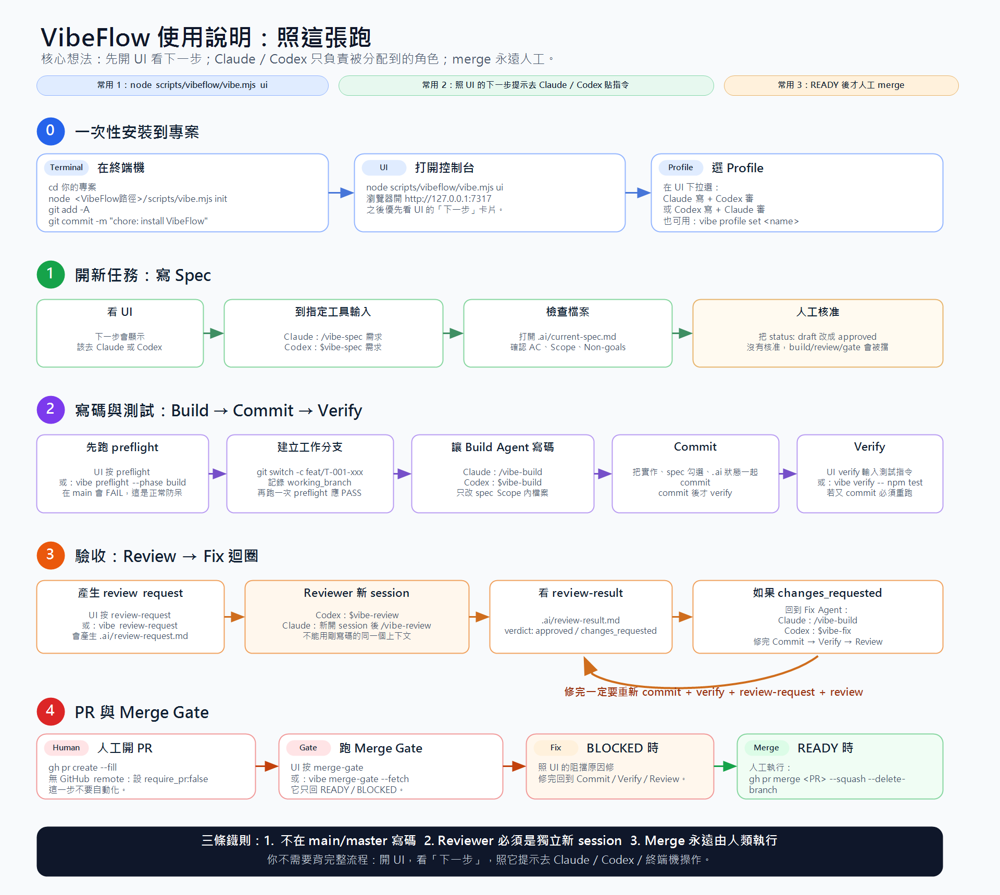

# VibeFlow

跨 **Claude Code** 與 **Codex** 的 AI vibe coding workflow。
**角色固定、工具可互換**:VibeFlow 不是「Claude 寫、Codex 審」,而是「Build Agent 寫、
Review Agent 審」— 哪個工具扮演哪個角色由 profile 決定(預設:Claude build、Codex review,
反過來也行)。兩個 agent 不共享聊天記憶,所以**一切協調都走 `.ai/` 檔案 + 確定性 script**;
LLM 負責產生內容,script 負責記住狀態、檢查安全。

```text
Roles fixed. Tools configurable. Review independent. Scripts deterministic. Merge human-only.
```

## 照這張跑



先開 UI 看「下一步」,照提示去 Claude / Codex 貼指令即可,不用背流程。
逐步文字版見 [docs/quickstart.md](docs/quickstart.md)。

```
Spec -> Build -> Verify -> Review -> Fix -> PR -> Merge Gate -> Done
                              ^________|
                             (fix 迴圈直到 approved)
```

- **零依賴**:純 Node.js(≥18)內建模組,Windows / macOS / Linux 皆可。
- **不自動 merge**:merge gate 只回報 READY/BLOCKED,merge 永遠由人執行。
- **單一事實來源**:skill 內容只有一份(`assets/skills/`),由 installer 複製到
  `.claude/skills/` 與 `.agents/skills/`。

## 安裝到任何專案

```bash
# 在目標專案根目錄(需為 git repo):
node <VibeFlow路徑>/scripts/vibe.mjs init
# 或從 VibeFlow 目錄指定目標:
node scripts/vibe.mjs init --target C:\path\to\your-project
# 要 GitHub PR 自動 review 加上:
node scripts/vibe.mjs init --target ... --with-github-action
```

init 會建立:

| 位置 | 內容 |
|---|---|
| `.ai/` | state.json、handoff.md、current-spec.md、review-request/result、decisions、task-log、vibe-flow.config.json |
| `scripts/vibeflow/` | 自足的 vibe CLI(含 assets,可重跑 init) |
| `.claude/skills/` | vibe-flow 核心 + 6 個 step skills(`/vibe-spec` 等) |
| `.agents/skills/` | 同上,給 Codex |
| `.claude/agents/` | 5 個 subagent(spec-writer / architect / implementer / verifier / fix-agent,含 model 設定) |
| `.claude/settings.json` | Stop hook(自動 handoff / review request)+ 窄權限;已存在則另存 `settings.vibeflow.json` 請手動合併 |
| `CLAUDE.md` / `AGENTS.md` | 加入 VibeFlow 指引區塊(marker 管理,可重跑) |
| `.github/workflows/` | (選用)Codex PR review Action |

## 日常流程

| 你想做 | Claude Code | Codex |
|---|---|---|
| 開新任務 | `/vibe-spec` | `$vibe-spec` |
| 實作 | `/vibe-build` | — |
| 交接 | `/vibe-handoff`(Stop hook 也會自動跑) | `$vibe-handoff` |
| 驗收 | — | `$vibe-review` 或 `codex exec "Read .ai/review-request.md and follow its Reviewer instructions exactly."` |
| Merge 前檢查 | `/vibe-merge-gate` | `$vibe-merge-gate` |

Script(兩邊 agent 與人類都用同一套):

```bash
node scripts/vibeflow/vibe.mjs status            # 現在在哪、誰持球
node scripts/vibeflow/vibe.mjs preflight         # 寫 code 前安全檢查(擋 main/master、髒 tree、落後 base…)
node scripts/vibeflow/vibe.mjs verify -- npm test # 跑測試並把結果綁定到 HEAD commit
node scripts/vibeflow/vibe.mjs handoff           # 重生 handoff 快照
node scripts/vibeflow/vibe.mjs review-request    # 產生驗收請求
node scripts/vibeflow/vibe.mjs pr-status         # PR 狀態(需 gh)
node scripts/vibeflow/vibe.mjs merge-gate --fetch # merge 前完整閘門
node scripts/vibeflow/vibe.mjs set phase=build owner_agent=implementer next_action="..." # 驗證過的狀態更新
```

也有等價的獨立入口:`vibe-init.mjs`、`vibe-status.mjs`、`vibe-preflight.mjs`、
`vibe-handoff.mjs`、`vibe-review-request.mjs`、`vibe-pr-status.mjs`、`vibe-merge-gate.mjs`。

## Profile(角色 → 工具/模型)

`.ai/vibe-flow.config.json` 的 `active_profile` 決定每個角色由哪個工具、哪個 model 扮演:

```bash
node scripts/vibeflow/vibe.mjs profile                                # 看目前分工
node scripts/vibeflow/vibe.mjs profile set codex-build-claude-review  # 反向:Codex 寫、Claude 審
```

內建兩個 profile:`claude-build-codex-review`(預設)與 `codex-build-claude-review`;
可在 config 自訂更多。舊版只有 `agents` 欄位的 config 仍然有效(向後相容)。
其餘開關:`auto_review`、`hooks_enabled`、`allow_auto_pr`、`require_pr`、`base_branch`、
`test_command`;`allow_auto_merge` 一律視為 false(程式硬編碼)。
Claude 端 subagent 實際生效的是 `.claude/agents/vibe-*.md` frontmatter 的 `model:`;
Codex 端用 `codex exec -m <model>`。改 profile 時兩處保持一致。

**Review 獨立性鐵律**:不管誰寫誰審,reviewer 必須是**全新的獨立 session**,
絕不能是剛寫完 code 的那個上下文。同工具自審(Claude 寫 + 新 Claude session 審)可以;
同一個 session 自寫自審不行 — scripts 與 skills 都會提醒這件事。

## UI 控制台

```bash
node scripts/vibeflow/vibe.mjs ui        # http://127.0.0.1:7317(--port 可改)
```

不用背命令:控制台顯示目前 phase、持球角色、**下一步該去哪個工具貼什麼指令**(附複製鈕)、
workflow stepper、阻擋原因、profile 切換器、`.ai/` 檔案預覽,以及安全按鈕
(status / preflight / handoff / review-request / pr-status / merge-gate)。
安全設計:只綁 `127.0.0.1`;所有變更都經 `vibe.mjs`(不繞過檢查);POST 需自訂 header
(擋惡意網頁 CSRF);`verify` 必須手動輸入測試指令並確認;**沒有** merge/force-push/reset 按鈕。
詳見 [docs/quickstart.md](docs/quickstart.md)。

## 文件

- [docs/quickstart.md](docs/quickstart.md) — **從零跑通的逐步指南(含 UI、雙向 profile、最小範例)**
- [docs/profile-examples.md](docs/profile-examples.md) — profile 格式、切換、自訂
- [docs/workflow.md](docs/workflow.md) — 完整流程與狀態機
- [docs/handoff-schema.md](docs/handoff-schema.md) — `.ai/` 檔案與 state.json schema
- [docs/review-rubric.md](docs/review-rubric.md) — 驗收 rubric(正式版在 skill 內)
- [docs/branch-policy.md](docs/branch-policy.md) — branch / PR 政策
- [docs/examples.md](docs/examples.md) — 端到端範例

## 安全邊界(設計即防呆)

- preflight / merge-gate 擋:main/master 直改、髒 tree、落後 base、conflict、無 spec、**spec 未經人核准(status: approved)**、無 PR、secret 進 diff、超出 Scope 的檔案。
- Claude 權限白名單只涵蓋狀態/報告類子命令;`verify`(會執行任意測試指令)與 `init` 刻意排除,每次都需要人批准。
- reviewer 只能寫 `.ai/review-result.md`,不碰實作檔。
- 每個新 commit 自動使測試與 review 失效(必須在 HEAD 上重跑)。
- Hook 只做 handoff/review-request,永遠 exit 0,不 merge、不寫 code。
